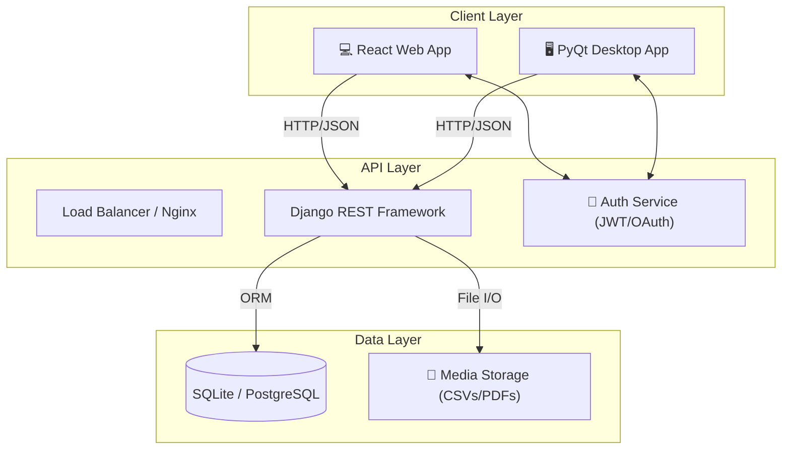
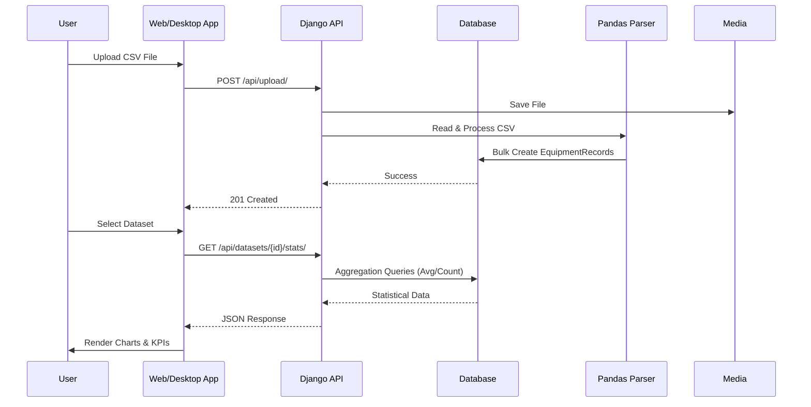

# ChemData Visualizer 🧪📊


**ChemData Visualizer** is a robust, full-stack application designed for real-time monitoring and analysis of chemical equipment data. It features a secure **Django REST API** backend, a modern **React** web dashboard, and a native **PyQt5** desktop application, ensuring seamless data access across platforms.

---

## 📸 Preview

|                                      **Web Dashboard**                                      |                                        **Desktop App**                                         |
| :-----------------------------------------------------------------------------------------: | :--------------------------------------------------------------------------------------------: |
|  _Real-time Analytics & KPI Cards_ |  _Native Interface with Teal Theme_ |

---

## 🏗️ System Architecture



### 🔄 Data Flow Pipeline



---

## 🚀 Key Features

- **🔐 Secure Authentication**:
  - JWT-based Token Authentication.
  - Google OAuth2 Integration (Web).
- **📊 Advanced Visualization**:
  - **Web**: Interactive `Chart.js` graphs (Bar, Trend, Distribution, Scatter).
  - **Desktop**: Native `Matplotlib` charts with interactive dropdowns & animations.
- **📂 Dataset Management**:
  - Drag-and-drop CSV Upload.
  - User-specific vs. Global History isolation.
- **📑 Reporting**:
  - One-click Professional PDF Report Generation (Tables, Charts, Branding).
  - Detailed "Report Cards" with header analysis.
- **🎨 Modern UI/UX**:
  - **Unified Theme**: Consistent Teal (`#0d9488`) & Slate design across Web and Desktop.
  - **Responsive**: Grid layouts with skeletal loading states.
  - **Interactive**: Filter charts by equipment type or metrics (Flow/Pressure/Temp).

---

## 🛠️ Technology Stack

| Component        | Technology                    | Description                                         |
| :--------------- | :---------------------------- | :-------------------------------------------------- |
| **Backend**      | **Django 5.0**                | Robust Python web framework.                        |
| **API**          | **Django REST Framework**     | Powerful toolkit for Web APIs.                      |
| **Database**     | **SQLite** (Dev)              | Lightweight database (easily scalable to Postgres). |
| **Web Frontend** | **React + Vite**              | High-performance frontend library.                  |
| **Styling**      | **Tailwind CSS**              | Utility-first CSS framework for rapid UI dev.       |
| **Desktop App**  | **PyQt5**                     | Python bindings for Qt5 application framework.      |
| **Plotting**     | **Chart.js** / **Matplotlib** | Data visualization libraries.                       |
| **Data Science** | **Pandas**                    | Data manipulation and analysis.                     |
| **PDF**          | **ReportLab**                 | Programmatic PDF generation engine.                 |

---

## 📂 Project Structure

```bash
ChemData-Visualizer/
├── 📂 backend/                 # Django Server
│   ├── 📂 api/                 # API Endpoints & Business Logic
│   ├── 📂 core/                # Project Settings & Config
│   ├── 📜 manage.py            # Django CLI
│   └── 📜 requirements.txt     # Python Dependencies
├── 📂 web-frontend/            # React Web Application
│   ├── 📂 src/                 # Source Code (Components, Pages)
│   ├── 📂 public/              # Static Assets
│   └── 📜 package.json         # Node Dependencies
├── 📂 desktop-frontend/        # PyQt5 Desktop Application
│   ├── 📂 ui/                  # UI Components (Auth, Dashboard)
│   ├── 📜 main.py              # Entry Point
│   └── 📜 config.py            # App Configuration
├── 📜 sample_equipment_data.csv # Test Dataset
└── 📜 README.md                # Project Documentation
```

---

## ⚡ Getting Started

### 1️⃣ Backend Setup (Django)

```bash
# Navigate to backend
cd backend

# Create virtual environment
python -m venv venv

# Activate environment (Windows)
venv\Scripts\activate

# Install dependencies
pip install django djangorestframework django-cors-headers dj-rest-auth django-allauth pandas reportlab

# Run Migrations
python manage.py migrate

# Start Server
python manage.py runserver
```

_Server will start at `http://127.0.0.1:8000/`_

### 2️⃣ Web Frontend Setup (React)

```bash
# Navigate to web-frontend
cd web-frontend

# Install node modules
npm install

# Start Development Server
npm run dev
```

_App will start at `http://localhost:5173/`_

### 3️⃣ Desktop App Setup (PyQt5)

```bash
# Ensure backend virtual env is active
cd backend
venv\Scripts\activate

# Install Desktop dependencies
pip install pyqt5 matplotlib requests

# Run Application
python ../desktop-frontend/main.py
```

---

## 🤝 Contributing

Contributions are welcome! Please fork the repository and create a pull request.

1.  Fork the Project
2.  Create your Feature Branch (`git checkout -b feature/AmazingFeature`)
3.  Commit your Changes (`git commit -m 'Add some AmazingFeature'`)
4.  Push to the Branch (`git push origin feature/AmazingFeature`)
5.  Open a Pull Request

---

## 📄 License

Distributed under the MIT License. See `LICENSE` for more information.
