# ChemData Visualizer 🧪📊

<div align="center">


</div>

**ChemData Visualizer** is a robust, full-stack application designed for real-time monitoring and analysis of chemical equipment data. It features a secure **Django REST API** backend, a modern **React** web dashboard, and a native **PyQt5** desktop application, ensuring seamless data access across platforms using **Docker** for easy deployment.

---

## 📸 Preview

|                                      **Web Dashboard**                                      |                                        **Desktop App**                                         |
| :-----------------------------------------------------------------------------------------: | :--------------------------------------------------------------------------------------------: |
|  _Real-time Analytics & KPI Cards_ |  _Native Interface with Teal Theme_ |

---

## 🏗️ System Architecture

```mermaid
graph TD
    subgraph "Client Layer"
        Web[💻 React Web App]
        Desktop[🖥️ PyQt Desktop App]
    end

    subgraph "API Layer"
        LB["Load Balancer / Nginx"]
        Django["Django REST Framework"]
        Auth["🔐 Auth Service (JWT/OAuth)"]
    end

    subgraph "Data Layer"
        DB[("SQLite / PostgreSQL")]
        Media["📂 Media Storage (CSVs/PDFs)"]
    end

    Web -->|HTTP/JSON| Django
    Desktop -->|HTTP/JSON| Django
    Django -->|ORM| DB
    Django -->|File I/O| Media
    Web <--> Auth
    Desktop <--> Auth
```



> **Note**: The entire stack can be containerized and deployed using **Docker**. See the [Getting Started](#-getting-started) section for details.

### 🔄 Data Flow Pipeline


---

## 🚀 Key Features

- **🔐 Secure Authentication**:
  - JWT-based Token Authentication.
  - Google OAuth2 Integration (Web).
- **📊 Advanced Visualization**:
  - **Web**: Interactive `Chart.js` graphs (Bar, Trend, Distribution, Scatter).
  - **Desktop**: Native `Matplotlib` charts with interactive dropdowns & animations.
- **📂 Dataset Management**:
  - Drag-and-drop CSV Upload.
  - User-specific vs. Global History isolation.
- **📑 Reporting**:
  - One-click Professional PDF Report Generation (Tables, Charts, Branding).
  - Detailed "Report Cards" with header analysis.
- **🎨 Modern UI/UX**:
  - **Unified Theme**: Consistent Teal (`#0d9488`) & Slate design across Web and Desktop.
  - **Responsive**: Grid layouts with skeletal loading states.
  - **Interactive**: Filter charts by equipment type or metrics (Flow/Pressure/Temp).

---

## 🛠️ Technology Stack

| Component        | Technology                    | Description                                         |
| :--------------- | :---------------------------- | :-------------------------------------------------- |
| **Backend**      | **Django 5.0**                | Robust Python web framework.                        |
| **API**          | **Django REST Framework**     | Powerful toolkit for Web APIs.                      |
| **Database**     | **SQLite** (Dev)              | Lightweight database (easily scalable to Postgres). |
| **Web Frontend** | **React + Vite**              | High-performance frontend library.                  |
| **Styling**      | **Tailwind CSS**              | Utility-first CSS framework for rapid UI dev.       |
| **Desktop App**  | **PyQt5**                     | Python bindings for Qt5 application framework.      |
| **Plotting**     | **Chart.js** / **Matplotlib** | Data visualization libraries.                       |
| **Data Science** | **Pandas**                    | Data manipulation and analysis.                     |
| **PDF**          | **ReportLab**                 | Programmatic PDF generation engine.                 |

---

## 📂 Project Structure

```bash
ChemData-Visualizer/
├── 📂 backend/                 # Django Server
│   ├── 📂 api/                 # API Endpoints & Business Logic
│   ├── 📂 core/                # Project Settings & Config
│   ├── 📜 manage.py            # Django CLI
│   └── 📜 requirements.txt     # Python Dependencies
├── 📂 web-frontend/            # React Web Application
│   ├── 📂 src/                 # Source Code (Components, Pages)
│   ├── 📂 public/              # Static Assets
│   └── 📜 package.json         # Node Dependencies
├── 📂 desktop-frontend/        # PyQt5 Desktop Application
│   ├── 📂 ui/                  # UI Components (Auth, Dashboard)
│   ├── 📜 main.py              # Entry Point
│   └── 📜 config.py            # App Configuration
├── 📜 sample_equipment_data.csv # Test Dataset
└── 📜 README.md                # Project Documentation
```

---

## ⚡ Getting Started

You can run the application either using **Docker** (Recommended for ease) or **Manually** (for individual development).

### Option 1: Run with Docker 🐳 (Recommended)

This will start the Backend (Django) and Web Frontend (React) simultaneously.

1.  **Prerequisites**: Install Docker Desktop.
2.  **Run Command**:
    ```bash
    docker-compose up --build
    ```
3.  **Access**:
    - **Web App**: [http://localhost:5173](http://localhost:5173)
    - **API**: [http://127.0.0.1:8000](http://127.0.0.1:8000)

_Note: If the build fails due to network issues, try the Manual method below._

---

### Option 2: Run Manually (Local Development)

Open **3 separate terminal windows** for the best experience.

#### Terminal 1: Backend (Django)

```bash
# Navigate to backend
cd backend

# 1. Create virtual environment (Run once)
python -m venv venv

# 2. Activate environment
# Windows:
venv\Scripts\activate
# Mac/Linux:
# source venv/bin/activate

# 3. Install dependencies
pip install -r requirements.txt

# 4. Run Migrations (Initialize DB)
python manage.py migrate

# 5. Start Server
python manage.py runserver
```

#### Terminal 2: Web Frontend (React)

```bash
# Navigate to web-frontend
cd web-frontend

# 1. Install node modules
npm install

# 2. Start Development Server
npm run dev
```

#### Terminal 3: Desktop App (PyQt5)

```bash
# Navigate to desktop-frontend
cd desktop-frontend

# 1. Install dependencies
pip install -r requirements.txt

# 2. Run Application
python main.py
```

---

## 🗄️ Accessing the Database

The project uses **SQLite** by default (`db.sqlite3` in the backend folder).

### Method 1: Django Admin (Recommended)

This provides a user-friendly interface to manage your data.

1.  **Create a Superuser**:
    _Make sure you are inside the `backend` directory._

    ```bash
    cd backend  # If you are in the project root
    python manage.py createsuperuser
    ```

    _Follow the prompts to set a username and password._\_

2.  **Access the Admin Panel**:
    - Go to [http://127.0.0.1:8000/admin](http://127.0.0.1:8000/admin)
    - Login with your credentials.

### Method 2: Direct File Access

You can view the raw `backend/db.sqlite3` file using:

- **VS Code Extensions**: Search for "SQLite Viewer" by Florian Klampfer or "SQLite" by alexcvzz.
- **Desktop Tools**: [DB Browser for SQLite](https://sqlitebrowser.org/).

---

## 🤝 Contributing

Contributions are welcome! Please fork the repository and create a pull request.

1.  Fork the Project
2.  Create your Feature Branch (`git checkout -b feature/AmazingFeature`)
3.  Commit your Changes (`git commit -m 'Add some AmazingFeature'`)
4.  Push to the Branch (`git push origin feature/AmazingFeature`)
5.  Open a Pull Request

---

## 💝 Credits

**Made with ❤️ by Mausam Kar**
