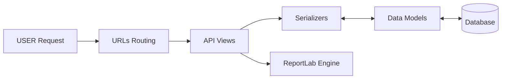

# 🔙 Backend API Server


The **Backend Server** acts as the central brain of the **ChemData Visualizer** ecosystem. Built with **Django REST Framework**, it handles authentication, data processing, statistical analysis, and PDF generation.

---

## 🏗️ Architecture

The backend follows a standard Django app structure, utilizing **Serializers** for JSON conversion and **Views** for business logic.



---

## 🔑 Key Features

- **Authentication**: Token-based Auth (DRF) & Google OAuth2 (Allauth).
- **Data Processing**: Pandas integration for efficient CSV parsing and statistical aggregation.
- **File Handling**: Secure upload and storage of Dataset CSVs.
- **Reporting**: On-the-fly PDF generation using `ReportLab`.
- **Security**: Environment variable inputs for Secrets and API Keys.

---

## 🛠️ Installation & Setup

### Prerequisites

- Python 3.10+
- pip

### Steps

1.  **Create Virtual Environment**

    ```bash
    python -m venv venv
    # Windows
    venv\Scripts\activate
    # Mac/Linux
    source venv/bin/activate
    ```

2.  **Install Dependencies**

    ```bash
    pip install -r requirements.txt
    ```

    _Core packages: `django`, `djangorestframework`, `pandas`, `reportlab`, `django-allauth`, `dj-rest-auth`_

3.  **Environment Configuration**
    Create a `.env` file in the `backend/` directory:

    ```ini
    SECRET_KEY=your_django_secret_key
    DEBUG=True
    GOOGLE_CLIENT_ID=your_google_client_id
    GOOGLE_CLIENT_SECRET=your_google_client_secret
    ```

4.  **Database Migration**

    ```bash
    python manage.py makemigrations
    python manage.py migrate
    ```

5.  **Run Server**
    ```bash
    python manage.py runserver
    ```
    _API will be available at `http://127.0.0.1:8000/`_

---

## 📡 API Endpoints

### 🔐 Authentication

| Method | Endpoint                  | Description                    |
| :----- | :------------------------ | :----------------------------- |
| `POST` | `/api/auth/registration/` | Register a new user account.   |
| `POST` | `/api/api-token-auth/`    | Login and retrieve Auth Token. |
| `POST` | `/accounts/google/login/` | Google OAuth2 Login.           |

### 📊 Datasets

| Method | Endpoint                | Description                               |
| :----- | :---------------------- | :---------------------------------------- |
| `GET`  | `/api/datasets/`        | List all datasets for the logged-in user. |
| `POST` | `/api/upload/`          | Upload a new CSV dataset.                 |
| `GET`  | `/api/datasets/global/` | List the global dataset history.          |

### 📈 Analysis

| Method | Endpoint                    | Description                                           |
| :----- | :-------------------------- | :---------------------------------------------------- |
| `GET`  | `/api/datasets/{id}/stats/` | Get calculated statistics (Avg Flow, Pressure, Temp). |
| `GET`  | `/api/datasets/{id}/data/`  | Retrieve raw row-level data.                          |
| `GET`  | `/api/datasets/{id}/pdf/`   | Download generated PDF report.                        |

---

## 🗄️ Database Models

- **User**: Extended Django User model.
- **Dataset**: Represents an uploaded CSV file.
  - `user`: Owner (FK).
  - `file`: Path to CSV.
  - `uploaded_at`: Timestamp.
- **EquipmentRecord**: Individual data rows parsed from CSV.
  - `dataset`: Parent Dataset (FK).
  - `equipment_name`: String.
  - `equipment_type`: (Pump, Valve, Tank, etc.).
  - `flowrate`, `pressure`, `temperature`: Float values.

---

## 🧪 Testing

Run the built-in test suite to verify API functionality:

```bash
python manage.py test api
```
