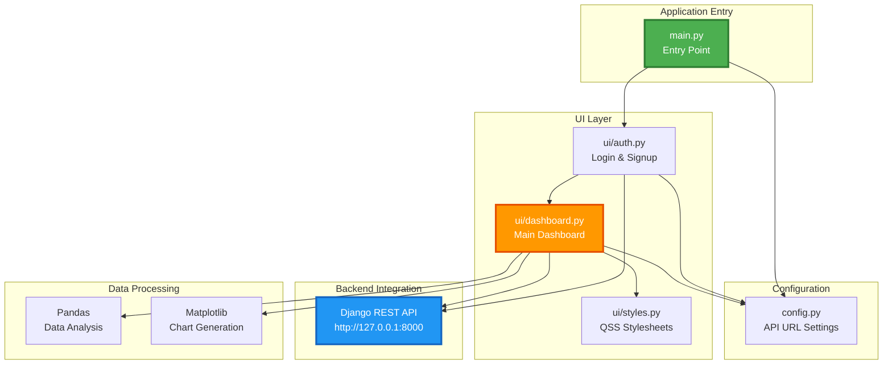
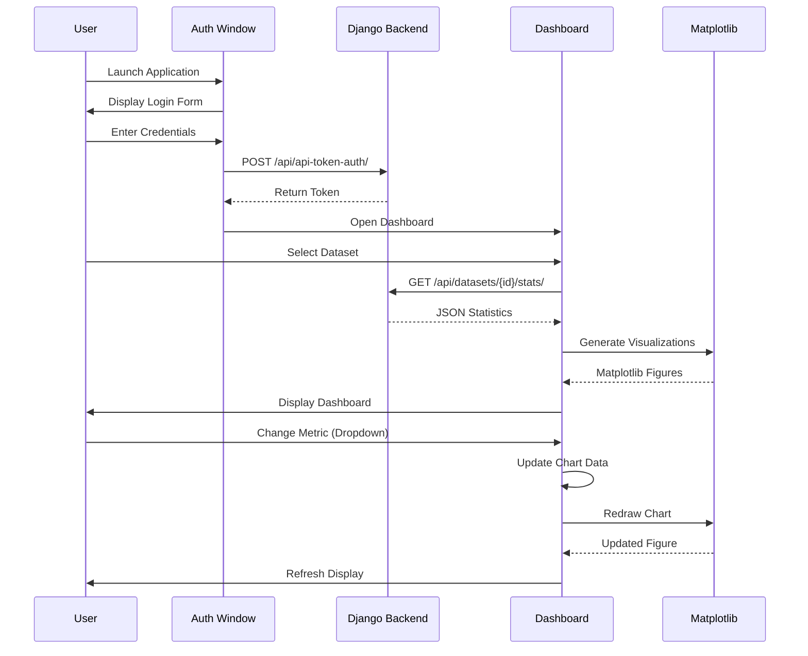

<div align="center">

# 🖥️ Desktop Application

### Native PyQt5 Chemical Equipment Monitor

[](https://riverbankcomputing.com/software/pyqt/)
[](https://matplotlib.org/)
[](https://www.python.org/)
[](https://pandas.pydata.org/)

[Overview](#-overview) • [Features](#-features) • [Installation](#-installation) • [Architecture](#-architecture)

</div>

---

## 📋 Overview

The **ChemData Visualizer Desktop Application** is a native Windows application built with **PyQt5** that provides powerful local data analysis capabilities for chemical equipment monitoring. It mirrors the web platform's functionality while leveraging native UI performance and deep system integration.

### Why Desktop App?

- 🚀 **Native Performance** - Direct system access, no browser overhead
- 🔌 **Offline Capability** - Work without internet connection
- 📊 **Advanced Plotting** - Matplotlib integration for high-quality charts
- 💾 **Local Storage** - Desktop file system integration
- 🎨 **Consistent Branding** - Matches web UI with teal (#0d9488) theme
- ⚡ **Fast Data Processing** - Pandas-powered analytics

---

## ✨ Features

### 🎨 Visual Design

- **Unified Theme** - Consistent teal (#0d9488) and slate color scheme matching web UI
- **Responsive Layouts** - `QStackedWidget` for seamless view transitions
- **Professional Styling** - QSS (Qt Style Sheets) for custom appearance
- **Dark Theme UI** - Modern dark mode interface
- **Custom Icons** - Branded visual elements

### 📊 Data Visualization

#### Analysis Dashboard

| Chart Type        | Description                  | Interactive Features                          |
| ----------------- | ---------------------------- | --------------------------------------------- |
| **Bar Charts**    | Average metrics by equipment | Dropdown metric selector (Flow/Pressure/Temp) |
| **Donut Charts**  | Equipment type distribution  | Color-coded segments                          |
| **Trend Charts**  | Time-series process data     | Dual-axis for multiple metrics                |
| **Scatter Plots** | Correlation analysis         | Customizable X and Y axes                     |

#### Data Management

- **KPI Cards** - Total records, equipment count, average values
- **Data Table** - Sortable, scrollable equipment records
- **Conditional Formatting** - Color-coded temperature warnings
- **Export Capabilities** - Save charts as PNG/SVG/PDF

### 🔐 Authentication

- **Login Interface** - Standard username/password authentication
- **Registration** - New account creation via API
- **Token Management** - Secure session handling
- **Visual Split** - Left form, right marketing visuals

---

## 🏗️ Application Architecture

### Component Structure



### Application Flow



---

## 📂 Project Structure

```
desktop-frontend/
├── ui/                           # UI Components
│   ├── __init__.py
│   ├── auth.py                   # Authentication UI
│   │   ├── LoginWindow           # Login form
│   │   └── SignupWindow          # Registration form
│   ├── dashboard.py              # Main Dashboard
│   │   ├── DashboardWindow       # Main window
│   │   ├── AnalysisTab           # Charts & KPIs
│   │   └── DataLogsTab           # Data table
│   └── styles.py                 # QSS Stylesheets
│       ├── TEAL_THEME            # Color constants
│       └── get_stylesheet()      # Style generation
│
├── assets/                       # Application Assets
│   └── logo.png                  # App icon
│
├── config.py                     # Configuration
│   └── API_URL                   # Backend endpoint
│
├── main.py                       # Application Entry
│   └── main()                    # Launch function
│
├── requirements.txt              # Python dependencies
└── README.md                     # This file
```

---

## 🛠️ Installation & Setup

### Prerequisites

| Requirement | Version | Notes                                |
| ----------- | ------- | ------------------------------------ |
| Python      | 3.10+   | Required for PyQt5                   |
| Backend API | Running | Must be accessible at configured URL |
| pip         | Latest  | Package manager                      |

### Installation Steps

#### Option 1: Standalone Installation

```bash
# Navigate to desktop-frontend
cd desktop-frontend

# Create virtual environment (recommended)
python -m venv venv

# Activate environment
# Windows:
venv\Scripts\activate
# Mac/Linux:
source venv/bin/activate

# Install dependencies
pip install -r requirements.txt

# Run application
python main.py
```

#### Option 2: Shared Environment with Backend

```bash
# From project root, activate backend environment
cd backend
venv\Scripts\activate

# Install desktop dependencies
cd ../desktop-frontend
pip install pyqt5 matplotlib requests pandas

# Run application
python main.py
```

### Configuration

Edit `config.py` to point to your API:

```python
# Development
API_URL = "http://127.0.0.1:8000/api/"

# Production
API_URL = "https://your-backend.herokuapp.com/api/"
```

---

## 🧩 Key Components

### ui/auth.py - Authentication Module

Handles user authentication and registration.

#### LoginWindow Class

**Features:**

- Username and password input fields
- "Remember Me" checkbox
- Login button with API integration
- Link to signup window
- Error message display

**Key Methods:**

```python
def handle_login(self):
    """Authenticate user and get token"""

def open_signup(self):
    """Switch to signup window"""
```

#### SignupWindow Class

**Features:**

- Extended registration form
- Email validation
- Password confirmation
- Account creation via API
- Visual marketing panel

**Key Methods:**

```python
def handle_signup(self):
    """Create new user account"""

def validate_inputs(self):
    """Form validation logic"""
```

---

### ui/dashboard.py - Main Dashboard

The core workspace with comprehensive data visualization.

#### DashboardWindow Class

Main application window with:

- Left sidebar for dataset selection
- Right content area with tabs
- Status bar for notifications
- Menu bar for actions

**Components:**

1. **Dataset Sidebar**
   - List of available datasets
   - Click to load data
   - Refresh button
   - Visual indicators

2. **Content Stack**
   - Empty state view (no data)
   - Analysis dashboard (data loaded)
   - Smooth transitions

3. **Analysis Tab**
   - **4 KPI Cards**: Total records, averages
   - **Bar Chart**: Metrics by equipment (interactive dropdown)
   - **Donut Chart**: Equipment distribution
   - **Trend Chart**: Flow & pressure over time
   - **Scatter Chart**: Correlation explorer (X/Y selectors)

4. **Data Logs Tab**
   - Sortable table widget
   - Styled badges for equipment types
   - Conditional formatting (red text for high temp)
   - Search and filter capabilities

**Key Methods:**

```python
def load_dataset(self, dataset_id):
    """Fetch and display dataset"""

def generate_charts(self, stats):
    """Create Matplotlib visualizations"""

def update_metric_chart(self, metric):
    """Refresh chart on metric change"""
```

---

### ui/styles.py - Styling System

Centralized QSS (Qt Style Sheets) for consistent theming.

**Color Constants:**

```python
TEAL_PRIMARY = "#0d9488"
SLATE_900 = "#0f172a"
SLATE_800 = "#1e293b"
SLATE_700 = "#334155"
```

**Style Categories:**

- Window backgrounds
- Button styles (primary, secondary, danger)
- Input fields and text areas
- List widgets and scroll bars
- Table styling
- Card components

---

## 🎨 UI/UX Design

### Color Palette

| Color             | Hex       | Usage                     |
| ----------------- | --------- | ------------------------- |
| **Teal Primary**  | `#0d9488` | Buttons, accents, headers |
| **Slate 900**     | `#0f172a` | Window backgrounds        |
| **Slate 800**     | `#1e293b` | Panel backgrounds         |
| **Slate 700**     | `#334155` | Borders, dividers         |
| **White**         | `#ffffff` | Text, active elements     |
| **Success Green** | `#10b981` | Success messages          |
| **Error Red**     | `#ef4444` | Error messages            |

### Typography

- **Headers**: 18-24px, Bold
- **Body**: 12-14px, Regular
- **Labels**: 11px, Medium
- **Tables**: 10-12px, Regular

### Spacing

- Padding: 8px, 16px, 24px
- Margins: 4px, 8px, 16px
- Border Radius: 6px (cards), 4px (buttons)

---

## 📊 Chart Types & Implementation

### Bar Chart - Average Metrics

```python
import matplotlib.pyplot as plt
from matplotlib.backends.backend_qt5agg import FigureCanvasQTAgg

fig, ax = plt.subplots(figsize=(8, 5))
ax.bar(equipment_types, values, color="#0d9488")
ax.set_title("Average Flowrate by Equipment")
canvas = FigureCanvasQTAgg(fig)
```

**Interactive Features:**

- Dropdown to switch between Flow, Pressure, Temperature
- Hover tooltips (using `mplcursors`)
- Export to PNG

### Donut Chart - Distribution

```python
fig, ax = plt.subplots()
colors = ['#0d9488', '#10b981', '#f59e0b', '#ef4444']
ax.pie(counts, labels=types, autopct='%1.1f%%',
       colors=colors, wedgeprops={'width': 0.4})
```

### Scatter Plot - Correlation

```python
fig, ax = plt.subplots()
ax.scatter(x_data, y_data, c='#0d9488', alpha=0.6)
ax.set_xlabel("Flowrate (m³/h)")
ax.set_ylabel("Pressure (bar)")
```

---

## 💻 Development

### Running inDevelopment Mode

```bash
# Enable debug logging
export QT_DEBUG_PLUGINS=1  # Linux/Mac
set QT_DEBUG_PLUGINS=1     # Windows

python main.py
```

### Hot Reload (Manual)

PyQt5 doesn't support hot reload. Restart the application after changes.

### Debugging

```python
# Add to main.py for debugging
import logging
logging.basicConfig(level=logging.DEBUG)
```

---

## 📦 Building for Distribution

### Using PyInstaller

```bash
# Install PyInstaller
pip install pyinstaller

# Build standalone executable
pyinstaller --noconsole --onefile --name="ChemDataVisualizer" main.py

# With icon (Windows)
pyinstaller --noconsole --onefile --icon=assets/logo.ico --name="ChemDataVisualizer" main.py
```

**Output:** `dist/ChemDataVisualizer.exe`

### Advanced PyInstaller Options

```bash
# Include all ui modules
pyinstaller --noconsole --onefile \
  --add-data "ui:ui" \
  --add-data "assets:assets" \
  --icon=assets/logo.ico \
  --name="ChemDataVisualizer" \
  main.py
```

### Creating Installer (Windows)

Use **Inno Setup** to create a Windows installer:

1. Install Inno Setup
2. Create `setup.iss` script
3. Build installer package

---

## 🐛 Troubleshooting

| Issue                          | Solution                                                    |
| ------------------------------ | ----------------------------------------------------------- |
| **API connection failed**      | Verify `API_URL` in `config.py` and backend is running      |
| **Import error: PyQt5**        | Install PyQt5: `pip install pyqt5`                          |
| **Charts not displaying**      | Install Matplotlib: `pip install matplotlib`                |
| **Window appears blank**       | Check QSS styles in `ui/styles.py`                          |
| **Token authentication fails** | Ensure backend accepts token auth                           |
| **DLL load failed**            | Reinstall PyQt5: `pip uninstall pyqt5 && pip install pyqt5` |

### Debug Backend Connection

```python
# Add to dashboard.py
import requests
response = requests.get(f"{API_URL}datasets/",
                       headers={"Authorization": f"Token {token}"})
print(response.status_code, response.text)
```

---

## 🔧 Customization

### Change Theme Colors

Edit `ui/styles.py`:

```python
TEAL_PRIMARY = "#your-color"
SLATE_900 = "#your-bg-color"
```

### Add New Chart

1. Create chart function in `dashboard.py`:

```python
def create_custom_chart(self, data):
    fig, ax = plt.subplots()
    # Your chart code
    return FigureCanvasQTAgg(fig)
```

2. Add to dashboard layout:

```python
chart_widget = self.create_custom_chart(stats)
layout.addWidget(chart_widget)
```

---

## 📚 Dependencies

| Package      | Purpose          |
| ------------ | ---------------- |
| `pyqt5`      | GUI framework    |
| `matplotlib` | Chart generation |
| `requests`   | HTTP API calls   |
| `pandas`     | Data processing  |

**Installation:**

```bash
pip install pyqt5 matplotlib requests pandas
```

---

## 🔗 Related Documentation

- [Root README](../README.md) - Project overview
- [Backend README](../backend/README.md) - API documentation
- [PyQt5 Documentation](https://www.riverbankcomputing.com/static/Docs/PyQt5/)
- [Matplotlib Gallery](https://matplotlib.org/stable/gallery/index.html)

---

## 👨‍💻 Author

**Mausam Kar**

- Portfolio: [mausam04.vercel.app](https://mausam04.vercel.app)

---

<div align="center">

**[⬆ Back to Top](#-desktop-application)**

Built with PyQt5 and Matplotlib

</div>
