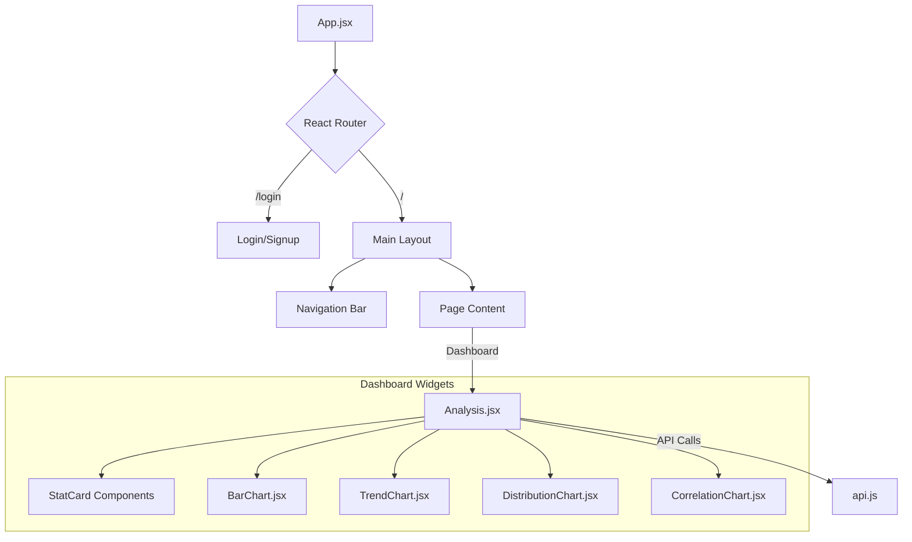

# 🌐 Web Frontend


The **Web Frontend** provides a modern, responsive dashboard for users to interact with the ChemData Visualizer system. Built with **React** and **Vite**, it offers high performance and a polished UI using **Tailwind CSS**.

---

## 🎨 UI Design System

- **Framework**: Tailwind CSS (Utility-first).
- **Theme**: Clean, Professional, Light/Dark accents.
- **Components**:
  - **Split-Screen Auth**: Modern Login/Signup pages with visual backgrounds.
  - **Dashboard Layout**: Sticky "Capsule" Navigation Bar.
  - **Interactive Graphs**: Dynamic Bar Charts powered by `Chart.js`.
  - **KPI Cards**: At-a-glance statistical summaries.

---

## 🏗️ Component Architecture



---

## 📂 Project Structure

```bash
web-frontend/
├── 📂 public/              # Static assets (Favicons, images)
├── 📂 src/
│   ├── 📂 components/      # Reusable UI Components
│   │   ├── 📜 Login.jsx    # Auth Screens
│   │   ├── 📜 Signup.jsx
│   │   ├── 📜 Analysis.jsx # Main Dashboard & Charts
│   │   └── 📜 Navbar.jsx   # (Integrated in App.jsx)
│   ├── 📜 App.jsx          # Main Router & Layout Logic
│   ├── 📜 api.js           # Axios Instance & Interceptors
│   ├── 📜 main.jsx         # Entry Point
│   └── 📜 index.css        # Tailwind Directives
├── 📜 index.html           # HTML Root
├── 📜 vite.config.js       # Bundler Configuration
└── 📜 tailwind.config.js   # Style Configuration
```

---

## 🛠️ Installation & Setup

### Prerequisites

- Node.js (LTS version recommended)
- npm

### Steps

1.  **Install Dependencies**

    ```bash
    npm install
    # or
    yarn install
    ```

2.  **Environment Configuration**
    Create a `.env` file in the `web-frontend/` directory to configure Google Auth:

    ```ini
    VITE_GOOGLE_CLIENT_ID=your_google_client_id
    ```

3.  **Run Development Server**

    ```bash
    npm run dev
    ```

    _Open `http://localhost:5173/` in your browser._

4.  **Build for Production**
    ```bash
    npm run build
    ```
    _Generates static files in `dist/` folder._

---

## 🧩 Key Components

### `App.jsx`

Handles the core routing state. It checks for authentication tokens and conditionally renders either the **Auth Screens** (Login/Signup) or the **Protected Dashboard**. It also manages the global full-screen vs. navbar layout.

### `Analysis.jsx`

The powerhouse of the dashboard.

- **Fetches Data**: Parallel API calls for Stats and Raw Data.
- **Visualizes**: Renders Chart.js Bar graphs.
- **Reports**: Triggers PDF download from the backend.

### `api.js`

A configured **Axios** instance that automatically attaches the `Authorization: Token [key]` header to every request, ensuring secure communication with the backend.

---

## 📦 Dependencies

| Package              | Purpose                    |
| :------------------- | :------------------------- |
| `react`              | UI Library                 |
| `axios`              | HTTP Client                |
| `chart.js`           | Data Visualization         |
| `react-chartjs-2`    | React wrapper for Charts   |
| `react-oauth/google` | Google Sign-In Integration |
| `tailwindcss`        | Styling                    |
